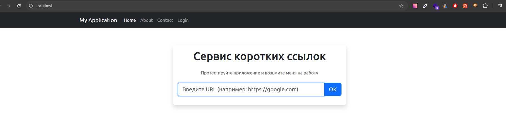
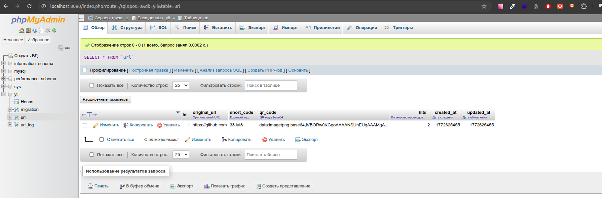
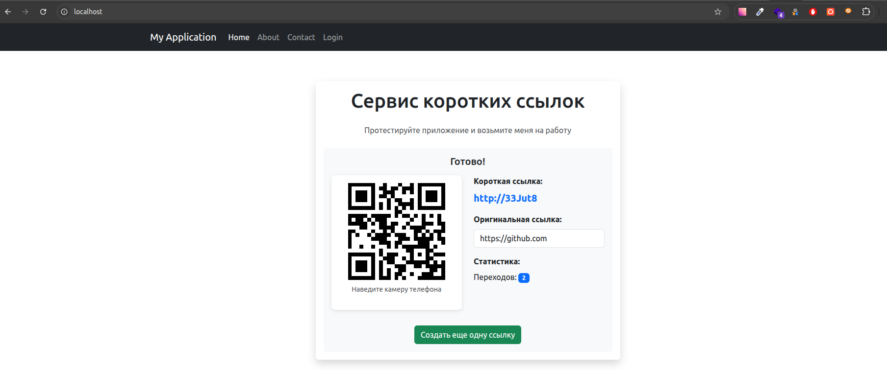
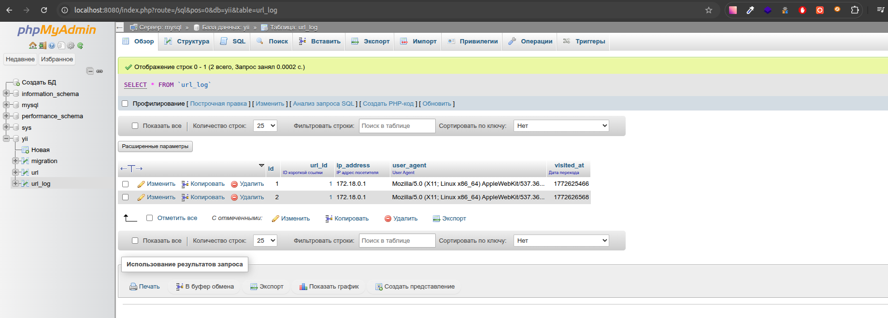

## URL Shortener / QR Code Generator

Сервис для создания коротких ссылок с автоматической генерацией QR-кодов на Yii2 (basic).

### Возможности

- ✂️ Сокращение длинных URL
- 📱 Автоматическая генерация QR-кодов
- 📊 Статистика переходов
- 🔍 Проверка доступности URL
- 📝 Логирование переходов (IP, User Agent, время)

### Проект состоит из:
- **Yii2**
- **Bootstrap 5 + jQuery**
- **MySQL 9.3**
- **Docker**

### Установка

1. Клонируем репозиторий и переходим в папку проекта:
```bash
git clone https://github.com/Longin89/URL-Shortener-QR-Code-Generator
```
```bash
cd URL-Shortener-QR-Code-Generator
```

2. Собираем и поднимаем проект:
```bash
docker-compose build
```
```bash
docker-compose up -d
```

3. Устанавливаем зависимости Composer:
```bash
docker exec yii_php bash -c "cd /var/www/qr-project && composer install"
```

5. Применяем миграции:
```bash
docker exec yii_php bash -c "cd /var/www/qr-project && php yii migrate --interactive=0"
```

6. Открываем в браузере:
```
http://localhost
```
Вуа-ля

##### PS если страница не открывается - пробуем дать полные права на папку


### Структура проекта

```
test/
├── compose.yaml           # Docker Compose конфигурация
├── php.ini               # Настройки PHP
├── my.cnf                # Настройки MySQL
├── vhost.conf            # Конфигурация Nginx
├── images/
│   └── php81fpm/         # Dockerfile для PHP
└── www/
    └── qr-project/       # Yii2 приложение
        ├── config/       # Конфигурация
        ├── controllers/  # Контроллеры
        ├── models/       # Модели
        ├── migrations/   # Миграции БД
        ├── views/        # Представления
        └── web/          # Публичная директория
```

### Доступ к phpMyAdmin

```
URL: http://localhost:8080
```


### Таблица `url`
- `id` - ID записи
- `original_url` - оригинальный URL
- `short_code` - короткий код (6 символов)
- `qr_code` - QR-код в base64
- `hits` - количество переходов
- `created_at`, `updated_at` - временные метки

### Таблица `url_log`
- `id` - ID записи
- `url_id` - связь с `url`
- `ip_address` - IP посетителя
- `user_agent` - User Agent браузера
- `visited_at` - время перехода

### Использование
После пападания на главную страницу


Ввбиваем корректную ссылку в input и нажимаем "OK" (или Enter), видим результат:



Ссылка кликабельна, qr-код считывается камерой телефона.
Соответствующий  результат можно увидеть в phpmyadmin:


